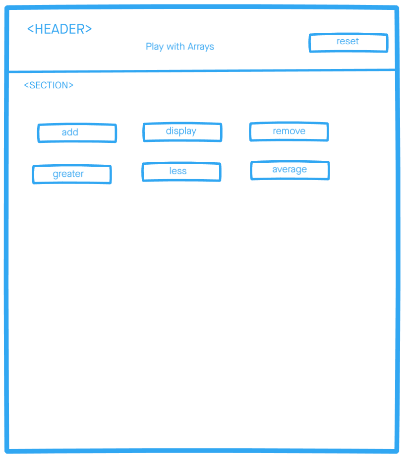

# Development Strategy

> `Testing project week 1`

## Array of numbers

A basic web page aim to learn JavaScript, testing and developed collaboratively using branches.

## Wireframe

## 0. Set-Up

_A User can see my initial repository and live demo_

> Assigned to Miroslav

### Repository

- Created a new repository from this [template](https://github.com/HackYourFutureBelgium/array-of-numbers)
- Clone the repository
- Write initial, basic README
- Add a wireframe
- Start the development strategy
- Prepare a project board
- Push the changes to GitHub
- Turn on GitHub Pages

## 1. Add Number

**As a site visitor, I want to be able to add numbers by clicking on 'add a number' button.**

> assigned to Eltayeb

This user story has been developed through a branch called 'add-number'.

### HTML

No html markup has been added on this user story.

### CSS

No styling has been added.

### javascript

Complete addNumberHandler function by reading user input, validate it and finally add it to the shared array of numbers.

## 2. Find all numbers greater than X

**As a site visitor, I want to be able filter all numbers which are greater than entered user number.**

> assigned to Eltayeb

### Repo

This user story has been developed through a branch called 'find-greater-than'.

### HTML

No html markup has been added on this user story.

### CSS

No styling has been added.

### javascript

- Write the findGreaterThan function logic. Then complete findGreaterThanHandler function.
- Validate if the filteredNumbers array is empty.

## 3. Style Main Page

**As a site visitor, I want to see a fancy website.**

> assigned to Mamé

### Repo

This user story has been developed through a branch called 'style'.

### HTML

- add header and section semantic tags
- add bootstrap links and font family links
- use bootstrap grid

### CSS

- add background img
- style buttons

### javascript

-Nothing has changed

## 4. Display all numbers in the array

**As a site visitor, I want to be able to display all numbers that user has added.**

> assigned to Miroslav

### Repo

This user story has been developed on a branch called 'display-array'.

### HTML

No html markup has been added on this user story.

### CSS

No styling has been added.

### javascript

- Write the logic for the function `reduceForAlert` and pass all tests.
- When a user click on the button _Display_, the alert should pop up with all numbers that user has added.
